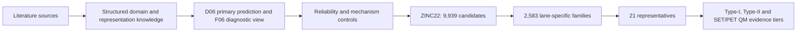

# Knowledge-informed prioritisation of two-photon radical photoinitiators

This repository records how heterogeneous photoinitiator literature was converted into traceable evaluation criteria, molecular representations, mechanism-specific decisions and validation routes for a six-task molecular-learning and ZINC22 screening workflow.

Release: **v2.0** · Snapshot: **2026-08-19**

## Five-minute review path

1. Read the workflow above and the status table below.
2. Inspect five end-to-end examples in [`examples/evidence_to_computational_use_examples.csv`](examples/evidence_to_computational_use_examples.csv).
3. Follow each manuscript concept through [`manuscript_repository_crosswalk.csv`](manuscript_repository_crosswalk.csv).
4. Check completeness and claim boundaries in [`AUDIT_REPORT.md`](AUDIT_REPORT.md).

## Repository map

| File | What a reviewer can verify |
|---|---|
| [`source_registry.csv`](source_registry.csv) | unique DOI, title, year, journal and evidence use |
| [`domain_knowledge_registry.csv`](domain_knowledge_registry.csv) | source → evidence → normalized evaluation criterion → downstream use |
| [`endpoint_representation_registry.csv`](endpoint_representation_registry.csv) | six targets; graph; D06/F06 and ablation descriptor status |
| [`mechanism_decision_registry.csv`](mechanism_decision_registry.csv) | Type-I/Type-II/SET-PET routing, context and claim limits |
| [`synthesis_route_evidence_registry.csv`](synthesis_route_evidence_registry.csv) | route precedent kept separate from mechanism evidence |
| [`model_evaluation_registry.csv`](model_evaluation_registry.csv) | frozen outer-test metrics and live descriptor-ablation status |
| [`screening_workflow_summary.csv`](screening_workflow_summary.csv) | ZINC22 application, family compression, representative selection and novelty QC |
| [`representative_qm_evidence_registry.csv`](representative_qm_evidence_registry.csv) | 21 representatives, QM evidence tiers, decisions and candidate-specific limits |

## Research status at this snapshot

| Component | Status | Public interpretation |
|---|---|---|
| Literature evidence | 44 unique DOI sources; metadata complete | existing evidence organised by computational role |
| Frozen models | D06/F06 outer-test audit and independent sigma_max evaluation available | D06 is primary; F06 disagreement is diagnostic |
| Strict-clean re-evaluation | six-task outer-test comparison complete; replacement gate still open | reported as a sensitivity/retraining audit, not promoted to the deployment backbone |
| Descriptor ablation | 6 of 7 scheduled five-fold experiments complete | dense-plus-PI-family remains running; no final winner claimed |
| ZINC22 application | 9,939 candidates → 2,583 families → 21 representatives | lane-specific portfolio, not global leaderboard |
| QM assessment | 20 neutral minima passed; one geometry-failed exclusion; lane-specific evidence tiers assigned | minimal computational closure with conservative claim ceilings |

## Interpretation boundary

The six tasks are predictive proxies, not six experimentally validated properties. Mechanism rules define admissibility; they do not prove mechanism. The final output is a **computationally prioritised, QM-assessed and mechanism-admissible candidate portfolio**, not a set of experimentally validated photoinitiator leads.

## Versioning and validation

`VERSION`, `package_manifest.json` and `checksums.sha256` freeze this snapshot. Run `python scripts/validate_release.py` from the repository root to verify checksums and screen the public files for absolute local paths or internal working labels.
